<p align="center">
  
</p>

# PCSS - Pilti Clinical Support System v2.0.0

[](https://github.com/umeshKandhalu/Pilti-X-RayProbe)
[]()

PCSS is a state-of-the-art Clinical Decision Support System designed for rapid, high-fidelity analysis of Medical Imaging (Chest X-Ray) and Cardiology (ECG). It leverages a multi-engine AI consensus architecture to provide clinicians with automated insights, anatomical heatmaps, and digital signal reconstruction.

---

## 🏗 System Architecture

The PCSS architecture is built on a high-availability microservices model, ensuring low-latency inference and professional-grade security.

```mermaid
graph TD
    A["📱 Flutter Frontend<br/>(Desktop/Web/Android/iOS)"] -->|Auth & HTTPS| B["⚡ FastAPI Gateway"]
    B -->|Security Validation| C["🛡 HMAC & JWT Middleware"]
    C -->|Secure Internal Storage| D["📦 MinIO Object Storage"]
    C -->|Diagnostic Inference| E["🧠 AI Analysis Pipeline"]
    
    subgraph E ["AI Analysis Pipeline"]
        E1["🔍 OOD Filter: ResNetAE"]
        E1 -->|Passed| E2{"📡 Modality Router"}
        E2 -->|Radiology| E3["☢️ RAD-DINO Engine<br/>(ViT Attention Rollout)"]
        E2 -->|Cardiology| E4["🫀 HuBERT-ECG<br/>(Cardio-Transformer)"]
        E3 --> E5["⚖️ Clinical Consensus Agent"]
        E4 --> E5
    end
    
    E5 -->|Diagnostic Metadata| B
    B -->|Rendering Request| F["📄 PDF Report Engine"]
    F -->|Serialized PDF| G["📦 MinIO Security Bucket"]
    B -->|Stream/Fetch| G
    B -->|Encrypted Response| A
```



---

## 🧠 Core AI Engines

### ☢️ Radiology: RAD-DINO Next-Gen ViT
The radiology engine utilizes the **RAD-DINO** Vision Transformer, specifically fine-tuned on million-scale chest radiography datasets.
- **Anatomical explainability**: Uses **Attention Rollout** to generate 518x518 high-resolution heatmaps.
- **Ensemble Stability**: Features a **Clinical Consensus Agent** that aggregates predictions from **ResNet50** and **DenseNet121** to ensure diagnostic robustness.
- **Diagnostic Masking**: Implements Gaussian-weighted attention masking to eliminate background noise and highlight pathological regions with 50/50 anatomical blending.

### 🫀 Cardiology: HuBERT-ECG Transformer
A specialized hybrid system for digitizing and interpreting paper-based ECG records.
- **Signal Reconstruction**: Converts paper scan grids into digital time-series data using custom computer vision filters.
- **Deep Analysis**: Employs the **HuBERT-ECG Cardio-Transformer** for pathology detection (e.g., Sinus Bradycardia, Arrhythmias).
- **Clinical Metrics**: Integrates **NeuroKit2** for heart rate variability (HRV), SDNN, and morphology quantification.

### 🔍 Anomaly Detection: ResNetAE OOD Filter
To maintain clinical integrity, PCSS includes a **Recursive Autoencoder (ResNetAE)** that acts as an Out-of-Distribution filter. Any non-medical images (e.g., landscapes, selfies) are automatically rejected with an `OOD_DETECTED` status.

---

## 🛠 Features

- **Professional Reporting**: Generates high-fidelity PDF clinical reports with automated figure captions and technical appendices.
- **Clinician Annotation Suite**: Allows doctors to mark or annotate pathological areas on both high-res X-rays and digitized ECG wave-traces directly within the UI.
- **Usage Quota Management**: Real-time tracking of AI runs and storage usage (1GB/100-run limits for trial accounts).
- **High-Res Viewer**: Full-screen, zoomable viewer for original and AI-enhanced diagnostic evidence.
- **Security First**: 24-hour JWT session persistence and HMAC-SHA256 request signing for all diagnostic payloads.

---

## 🚀 Tech Stack

- **Frontend**: Flutter (Cross-platform Dart), Riverpod v3 (State), Dio (Networking), Syncfusion (PDF Rendering).
- **Backend**: FastAPI (Python 3.9), PyTorch (Inference), Boto3 (MinIO), OpenCV-Python-Headless (Vision Processing).
- **Infrastructure**: MinIO (S3-compatible storage), Docker & Docker Compose (Containerization).

---

## 🚀 Quick Start (Docker - Recommended)

PCSS v2.1.0 is optimized for a **Docker-first** deployment. This ensures all model dependencies and environmental configurations are pre-packaged and stable.

### 1. Prerequistes
- [Docker & Docker Compose](https://docs.docker.com/get-docker/) installed.
- Access to the PCSS MinIO storage (or your own S3-compatible service).

### 2. Deployment
Run the entire stack with a single command:
```bash
docker-compose up -d
```
The system will be accessible at:
- **Frontend**: [http://localhost:8080](http://localhost:8080)
- **Backend API**: [http://localhost:8888](http://localhost:8888)

### 3. Production Release
To pull and run the official pre-built images from GitHub:
```bash
docker-compose -f docker-compose.prod.yml up -d
```

---

## 📖 Legacy Development & Setup
For developers who wish to run the stack natively without Docker, refer to the source code configuration in `app/` and `backend/`. However, we strongly recommend the Docker-based flow for production parity.
